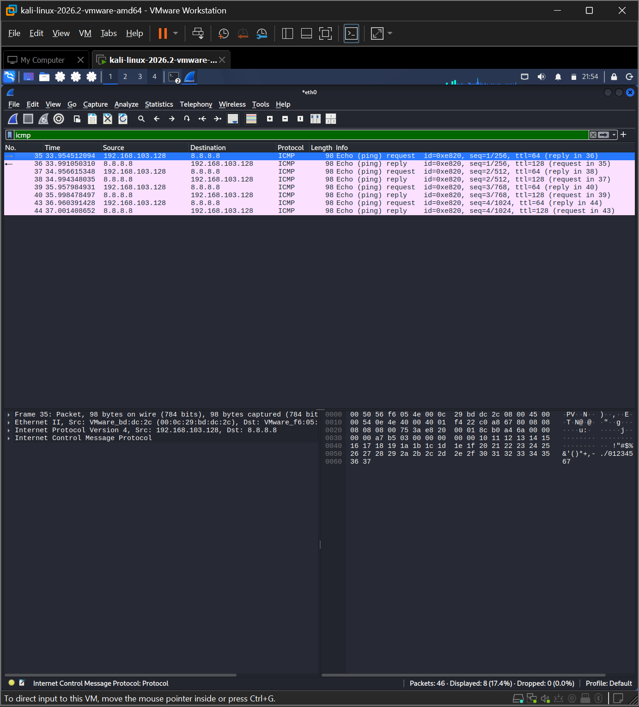
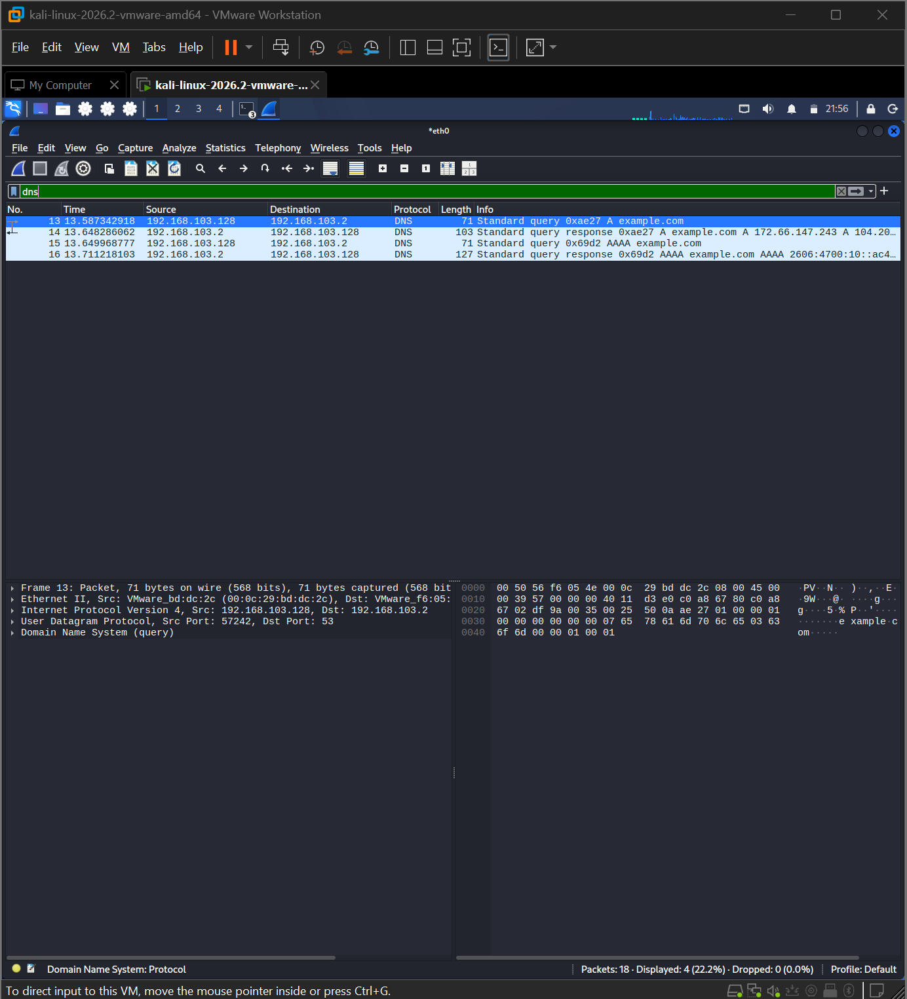
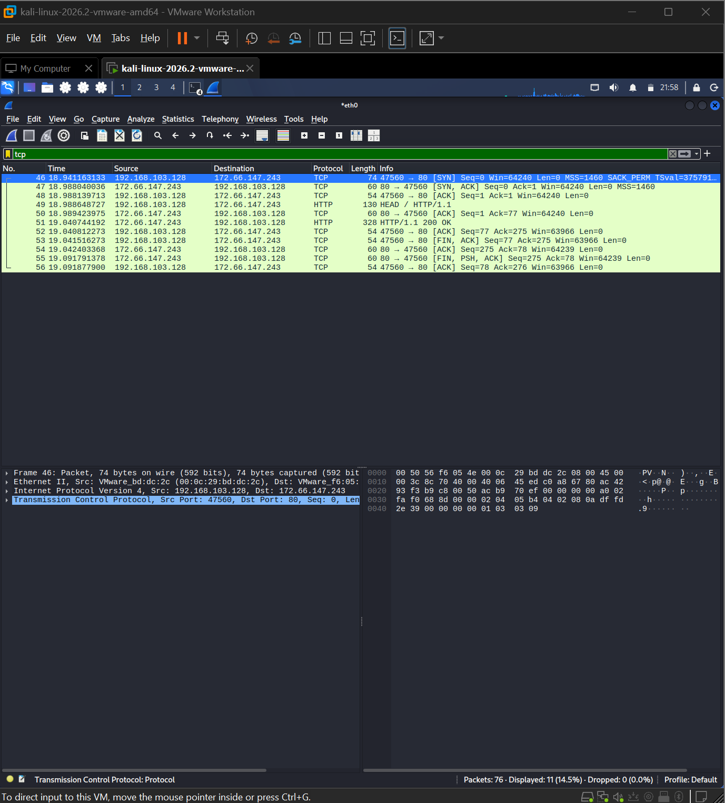
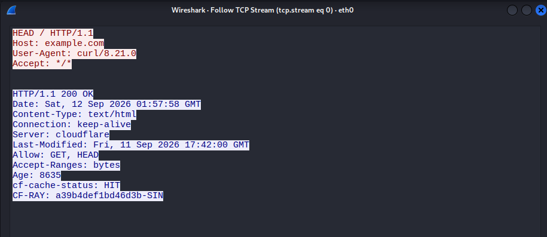

# Lab 01: Network Traffic Analysis

## Scenario

Analyze network traffic generated from a Kali Linux host using Wireshark.

## Objectives

- Identify common network protocols.
- Analyze ICMP communication.
- Analyze DNS queries and responses.
- Identify the TCP three-way handshake.
- Inspect HTTP traffic using TCP Stream.

## Tools

- Kali Linux
- Wireshark
- curl
- ping
- nslookup

## Investigation

### 1. ICMP Analysis

A ping test was performed to 8.8.8.8.

Observed:

- Protocol: ICMP
- Echo Request
- Echo Reply
- 0% packet loss

Evidence:



### 2. DNS Analysis

A DNS query for `example.com` was captured.

Observed:

- Protocol: DNS over UDP
- Destination port: 53
- DNS server: 192.168.103.2
- Query: `example.com`
- A and AAAA responses

Evidence:



### 3. TCP Three-Way Handshake

A TCP connection to `172.66.147.243:80` was analyzed.

Observed sequence:

```text
SYN
SYN, ACK
ACK
Evidence:



### 4. HTTP Analysis

The TCP stream showed an HTTP request to `example.com`.

Observed:

- Method: `HEAD`
- Host: `example.com`
- User-Agent: `curl/8.21.0`
- Response: `HTTP/1.1 200 OK`

Evidence:



## Findings

The captured traffic showed normal network communication involving ICMP,
DNS, TCP, and HTTP.

No clear malicious indicators were identified in the captured traffic.

The investigation demonstrated the ability to:

- Identify network protocols.
- Analyze source and destination information.
- Understand TCP connection establishment.
- Inspect application-layer traffic.
- Extract useful network indicators from packets.

## MITRE ATT&CK

No MITRE ATT&CK technique was mapped because the captured traffic did not
provide sufficient evidence of malicious activity.

## Conclusion

This lab demonstrates basic network traffic analysis skills using Wireshark
and provides a foundation for SOC Tier 1 network investigations.
